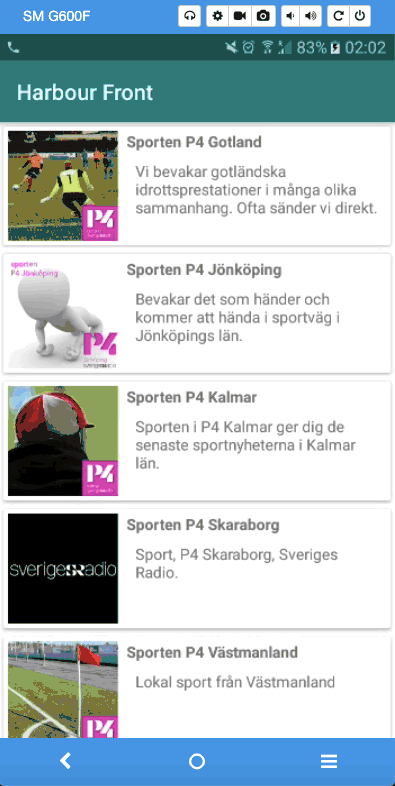

<h1>Sweden Radio App(Harbour)</h1>

Created this app that shows a list of Radio Sweden's programs, with functionality to show a detail page of the items with more information. Backing the data for this app is Radio Swedens open API.  
MVVM(Model-View-ModelView) architectural pattern was used.

<h2>Externally Used Library</h2>
<a href = "https://square.github.io/retrofit/">Retrofit</a> and <a href = "https://square.github.io/okhttp/">OkHttp</a> fetch data from server as JSON data type. 
<a href = "https://github.com/google/gson">Gson</a> allows us to convert data from json to our object models  

<h2>Screen Gif</h2>

